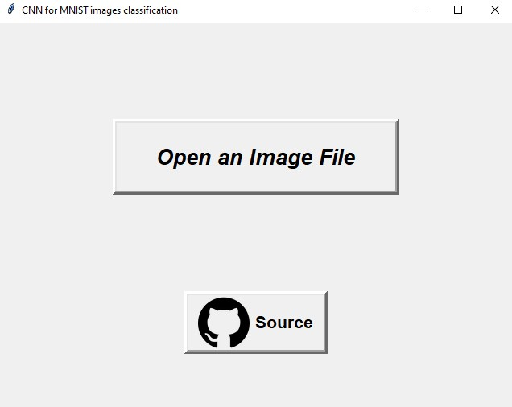
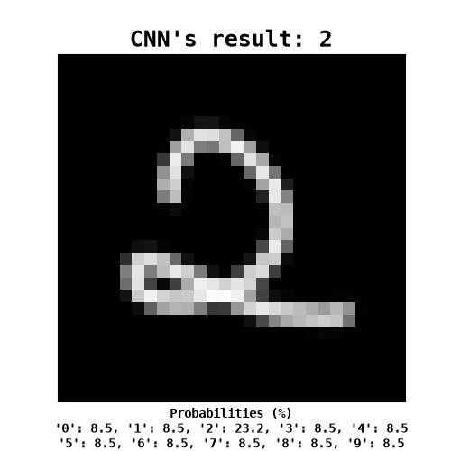

# CNN MNIST CLASSIFIER GUI APPLICATION

  
  

## About
**This is an application that uses convolutional neural network to classify MNIST images, with simple interactive UI.**
- Model Architecture: see in [Notebook](https://github.com/thangkaka26/cnn-mnist-classifier/blob/main/archived/training.ipynb)
- Training Dataset: [TrainingSet](https://github.com/thangkaka26/cnn-mnist-classifier/tree/main/archived/data/trainingSet/trainingSet)
- Dataset Source: [Kaggle](https://www.kaggle.com/datasets/scolianni/mnistasjpg)

## Installation
- Download the executable file (.exe) in [releases](https://github.com/thangkaka26/cnn-mnist-classifier/releases).
- Optional: download the sample images for quick testing.

## Usage
- Open the executable file (.exe) and you know what to do.  

## Notes
- The application might not open immediately as the executable file size is not small (over 300 MB).
- Images resolution must be 28x28 for application to work.
- Input images can be hand-drawn (Adobe PS, MS Paint, ...).  
  
> I did this in my free time, no deadline, just a stuff that an unemployed might do.  
> Im too lazy to write documents, you can check [archived](https://github.com/thangkaka26/cnn-mnist-classifier-gui-app/tree/markdown-screenshots-1/archived).
